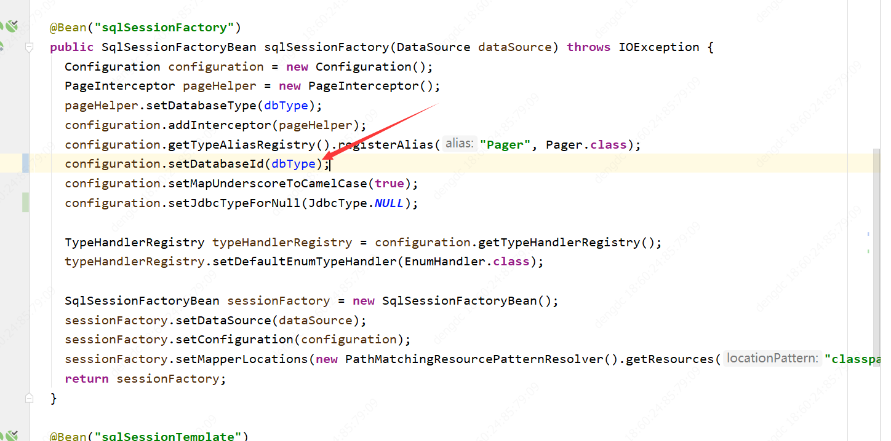
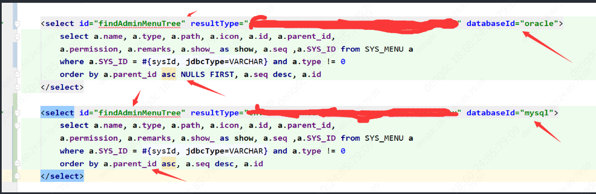
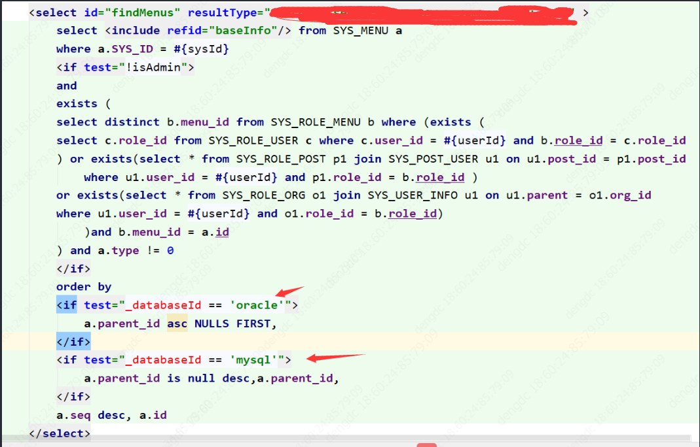
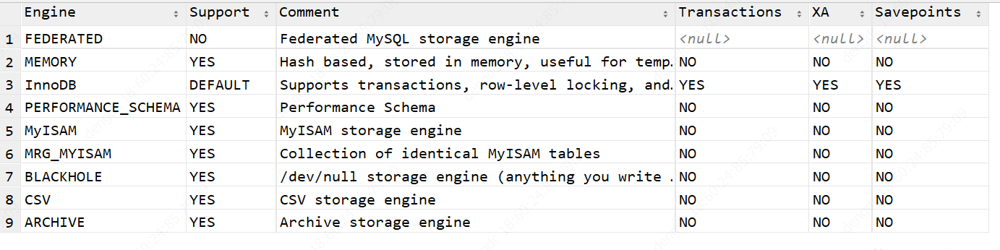

>最近项目准备由oracle数据库转到mysql，记录下注意事项
<!--more-->

## 项目变更
### 添加依赖
```
<dependency>
<groupId>mysql</groupId>
<artifactId>mysql-connector-java</artifactId>
</dependency>
```


### 配置文件
username: xxx  
password: xxx  
driver-class-name: com.mysql.jdbc.Driver  
jdbc-url: jdbc:mysql://ip:port/ibcp  
ibcp 是数据库名称  


### 多数据库类型兼容办法
当sql必须要用到特殊语法的时候需要写两条不同sql 兼容  
解决方法  
#### 添加配置代码

设置 configuration.setDatabaseId(dbType);  
dbType 读取配置的数据库类型  
#### xml改造
##### 方法一

适合sql相似度很低的情况
##### 方法二

适合sql相似度较高的情况
#### 需要改造的sql类型
1. a.parent_id asc NULLS FIRST(last) 
    改成
a.parent_id is null desc(asc) ,a.parent_id

2. 当前时间 sysdate 改成 CURRENT_TIMESTAMP()

3. delete table => delete from table(两个数据库都可以使用)

4. select listagg(b.name, ',') within group(order by 
c.post_oa_id) from SYS_USER_INFO b
改为
select group_concat(b.name) from SYS_USER_INFO b
group by c.post_oa_id

5. long 类型不能和varchar比较 会丢失精度，long转成string再比较

### 数据结构变更
NUMBER（n,m） 如果m存在，改成 decimal
不存在 如果 n < 10 改成 INT 大于改成BIGINT，主键同一用BIGINT

varchar2（n） 改成 varchar(n) 经过测试mysql的n代表文本字的个数和类型无关
clob 改成MEDIUMTEXT

### 表名
mysql 表名 区分大小写 同一用大写处理
### 自增
```sql
create table SYS_ORG(  
ID          bigint auto_increment,   
constraint pk_sys_org PRIMARY KEY (id)) 
comment = '系统模块_组织架构' auto_increment = 100000;
```

auto_increment = 100000 可以设置初始值
### 添加注释
```sql
create table SYS_DICT
(
REF_KEY VARCHAR(255) not null comment '修改后的表的注释',
) comment = '系统模块_数据字典表';
修改 表
alter table SYS_DICT comment '修改后的表的注释'
修改列
alter table SYS_DICT modify REF_KEY VARCHAR(255) not null comment '修改后的表的注释';
```

## mysql 简介
### 基本信息
#### 表engines
show engines
查看数据库支持的engine

一般默认InnDb 有事物 support 的DEFAULT 标识默认
#### 版本
select version();
#### 默认字符集
grantgr

### 数据结构
[点击查看](https://www.runoob.com/mysql/mysql-data-types.html)

### 用户相关
[参考](https://www.jianshu.com/p/d7b9c468f20d)
#### 创建用户
连接数据库

连接数据库通用格式:mysql -P 端口号 -h mysql主机名或ip地址 -u 用户名 -p
解释: (-P大写P代表端口,小写p代表密码,h代表主机名或ip,u代表user用户)"
EG: mysql -P 3306 -h 192.168.1.104 -u root -p

1.本地连接
如果是命令行是mysql所在的本机,而且用默认的端口 3306 时,可以简化语句为:
mysql -u root -p
2.远程连接
注意: 使用远程连接时,使用的连接用户和该用户现在的ip地址应该是远程数据库中允许的用户和允许的ip,否则是不允许连接的.
mysql -P 3306 -h 192.168.1.104 -u root -p

一. 创建用户
命令:
ALTER USER '2'@'%' IDENTIFIED WITH mysql_native_password BY '2';
CREATE USER 'username'@'host' IDENTIFIED BY 'password';
说明：
username：你将创建的用户名
host：指定该用户在哪个主机上可以登陆，如果是本地用户可用localhost，如果想让该用户可以从任意远程主机登陆，可以使用通配符%
password：该用户的登陆密码，密码可以为空，如果为空则该用户可以不需要密码登陆服务器
例子：
```sql
CREATE USER 'dog'@'localhost' IDENTIFIED BY '123456';
CREATE USER 'pig'@'192.168.1.101_' IDENDIFIED BY '123456';
CREATE USER 'pig'@'%' IDENTIFIED BY '123456';
CREATE USER 'pig'@'%' IDENTIFIED BY '';
CREATE USER 'pig'@'%';
```
#### 创建数据库
CREATE DATABASE 数据库名

#### 授权

命令:
GRANT privileges ON databasename.tablename TO 'username'@'host'
说明:
privileges：用户的操作权限，如SELECT，INSERT，UPDATE等，如果要授予所的权限则使用ALL
databasename：数据库名
tablename：表名，如果要授予该用户对所有数据库和表的相应操作权限则可用*表示，如*.*
例子:
GRANT SELECT, INSERT ON test.user TO 'pig'@'%';
GRANT ALL ON *.* TO 'pig'@'%';
注意:
用以上命令授权的用户不能给其它用户授权，如果想让该用户可以授权，用以下命令:

GRANT privileges ON databasename.tablename TO 'username'@'host' WITH GRANT OPTION;


