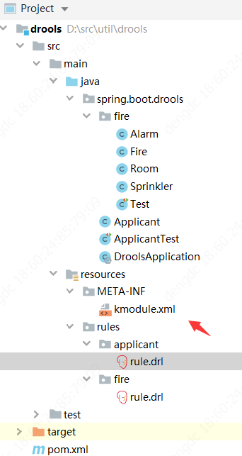
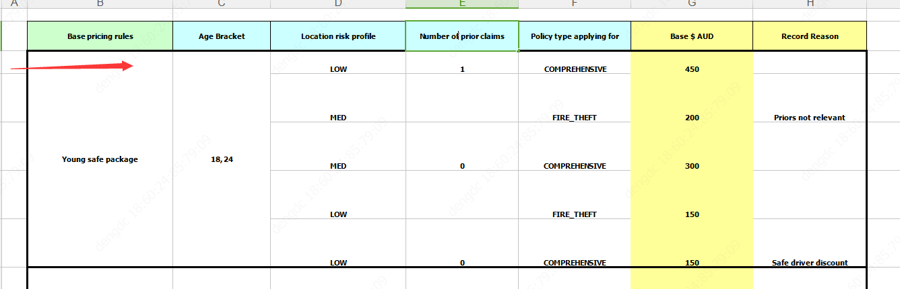

  >最近项目要调研drools,花了2天时间查阅了许多资料，记录下
<!--more-->
  
## 简介
Drools 是用 Java 语言编写的开放源码规则引擎，使用 Rete 算法对所编写的规则求值。可以将 Java 代码直接嵌入到规则文件中。支持整体前向链接和逻辑流程中的后向链接段来评估规则，可使用xls,dsl等编写规则。它并不是简单的if else判断, 而是结果的动态推演。  
据说国外在金融场景使用较多  
经过初步了解，个人感觉有以下优缺点  
优点：  
1.只需关注规则，结果由引擎演变出来,在特定场景下代码量大幅减少，规则变更成本低  
2.可直接调用java代码  
3.上手容易  
4.可动态部署  
缺点：  
1.文档复杂，国内资料少，深入使用，调优需消耗许多精力  
2.由于演变过程交给引擎处理，不确定确定增多，调试难度加大，容易出现bug
## 快速上手
### 项目搭建
#### pom
```
<dependency>
            <groupId>org.kie</groupId>
            <artifactId>kie-api</artifactId>
            <version>${drools.version}</version>
        </dependency>
        <dependency>
            <groupId>org.kie</groupId>
            <artifactId>kie-spring</artifactId>
            <version>${drools.version}</version>
        </dependency>
        <dependency>
            <groupId>org.drools</groupId>
            <artifactId>drools-core</artifactId>
            <version>${drools.version}</version>
        </dependency>
        <dependency>
            <groupId>org.drools</groupId>
            <artifactId>drools-compiler</artifactId>
            <version>${drools.version}</version>
        </dependency>
        <dependency>
            <groupId>org.drools</groupId>
            <artifactId>drools-decisiontables</artifactId>
            <version>${drools.version}</version>
        </dependency>
        <dependency>
            <groupId>org.drools</groupId>
            <artifactId>drools-templates</artifactId>
            <version>${drools.version}</version>
        </dependency>
```
#### 项目结构

#### 创建相关文件
在resources/META-INF 里创建kmodule.xml
内容
```xml
<?xml version="1.0" encoding="UTF-8"?>
<kmodule xmlns:xsi="http://www.w3.org/2001/XMLSchema-instance"
         xmlns="http://www.drools.org/xsd/kmodule">
    <kbase name="KBase1" packages="rules.fire">
        <ksession name="rules.fire"/>
    </kbase>
</kmodule>
```
在resources/rules/fire 创建rule.drl
```java
package rules.fire
// 与kmodule.xml里 kbase 的package对应 判断规则在哪个kbase生效
//相关概念：
//Fact（事实）:对象之间及对象属性之间的关系 比如Alarm Fire等
//Rule（规则）:是由条件和结论构成的推理语句，一般表示为if…Then。一个规则的if部分称为LHS（left-hand-side），then部分称为RHS（right hand side）。
//Module（模式）：就是指IF语句的条件。这里IF条件可能是有几个更小的条件组成的大条件。模式就是指的不能在继续分割下去的最小的原子条件。

import spring.boot.drools.fire.*

rule "Status output when things are ok"
when
    not Alarm() // 没有警报
    not Sprinkler( on == true ) // 没有打开的消防车
then
    System.out.println( "Everything is ok" );
end

rule "When there is a fire turn on the sprinkler"
when
  Fire($room : room) // 有Fire对象，并且创建变量$room值为Fire.room  表示出现火灾
  $sprinkler : Sprinkler(room == $room, on == false) // 并且有room == $room, on == false 的Sprinkler对象，并将匹配值赋值给变量$sprinkler 火灾房间洒水车没有洒水
then
  modify($sprinkler) { setOn(true) }; // 修改变量$sprinkler 设置on = true 打开洒水车
  System.out.println("Turn on the sprinkler for room "+$room.getName());
end

rule "When there is not fire turn off the sprinkler"
when
  $sprinkler : Sprinkler($room: room, on == true) // 房间洒水车打开中
  not Fire(room == $room ) // 并且这个房间没有火
then
  modify($sprinkler) { setOn(false) }; // 关闭洒水车
  System.out.println("Turn off the sprinkler for room "+$room.getName());
end

rule "Raise the alarm when we have one or more fires"
when
    exists Fire() // 有火
then
    insert( new Alarm() ); // 响起警报
    System.out.println( "Raise the alarm" );
end

rule "Cancel the alarm when all the fires have gone"
when
    not Fire() // 没有火
    $alarm : Alarm() // 有警报
then
    delete( $alarm ); // 关闭警报
    System.out.println( "Cancel the alarm" );
end


```
测试代码
```java
    KieServices kieServices = KieServices.Factory.get();
    KieContainer kContainer = kieServices.getKieClasspathContainer(); // 加载 kmodule.xml
    KieSession ksession = kContainer.newKieSession("rules.fire"); // 创建kmodule.xml 里面对应的ksession（根据name属性）

    String[] names = new String[] {"kitchen", "bedroom", "office", "livingroom"};
    Map<String, Room> name2room = new HashMap<>();
    for (String name : names) { // 生成4个Room 房间里配有Sprinkler
      Room room = new Room();
      room.setName(name);
      name2room.put(name, room);
      ksession.insert(room);
      Sprinkler sprinkler = new Sprinkler();
      sprinkler.setRoom(room);
      ksession.insert(sprinkler);
    }

    ksession.fireAllRules(); // 运行规则
    // 匹配 rule "Status output when things are ok"
    // 打印  Everything is ok

    // 两个房间着火
    Fire kitchenFire = new Fire();
    kitchenFire.setRoom(name2room.get("kitchen"));
    Fire officeFire = new Fire();
    officeFire.setRoom(name2room.get("office"));

    FactHandle kitchenFireHandle = ksession.insert(kitchenFire);
    FactHandle officeFireHandle = ksession.insert(officeFire);

    ksession.fireAllRules();
    // 匹配 rule "When there is a fire turn on the sprinkler" 和 rule "Cancel the alarm when all the fires have gone"
    // 如果无任何冲突优先级也一样按从上到下执行
    // 打印
    // Turn on the sprinkler for room kitchen
    // Turn on the sprinkler for room office
    // Raise the alarm

    // 着火房间火消失
    ksession.delete(kitchenFireHandle);
    ksession.delete(officeFireHandle);

    ksession.fireAllRules();
    // 匹配规则 rule "When there is not fire turn off the sprinkler" 和 rule "Cancel the alarm when all the fires have gone"
    // 打印
    // Turn off the sprinkler for room kitchen
    // Turn off the sprinkler for room office
    // Cancel the alarm
    // 因规则 modify($sprinkler) { setOn(false) }; // 关闭洒水车 修改了sprinkler 触发规则重新匹配
    // 此时规则 rule "Status output when things are ok" 匹配
    // 打印
    // Everything is ok
    // 这就是规则引擎的魅力之一，Fact(事实)的变化会触发规则的重新匹配直到fact无任何变化，
    // 这意味着规则引擎可以根据制定的规则演变出最终结果，规则变化，结果也会合理的变化
    // 而这如果使用代码实现将会复杂许多，并且规则变化导致的代码变化的工作量难以评估。
    // 
    ksession.destroy();
```
bean
```java
public class Alarm { }
```
```java
public class Fire {
  private Room room;
  // Getter and setter methods
}
```
```java
public class Room {
  private String name;
  // Getter and setter methods
}
```
```java
public class Sprinkler {
  private Room room;
  private boolean on;
  // Getter and setter methods
}
```
执行结果

Everything is ok  
Turn on the sprinkler for room kitchen  
Turn on the sprinkler for room office  
Raise the alarm  
Turn off the sprinkler for room kitchen  
Turn off the sprinkler for room office  
Cancel the alarm  
Everything is ok  

## 经典例子
### 保险缴费金额（使用xls决策表）
[例子链接](https://github.com/kiegroup/drools/tree/master/drools-examples)
在官方例子里面的org.drools.examples.decisiontable 和 org.drools.examples.decisiontable-template 里面  
[文档地址](https://docs.jboss.org/drools/release/7.31.0.Final/drools-docs/html_single/index.html#decision-examples-pricing-ref_drools-examples)
具体代码自行获取，我只说效果  
可使用xsl 配置获取保险缴费金额

xls如上图， 实现效果，输入一个Driver,属性如下  
Age Bracket： 20  
Location risk profile： LOW  
Number of prior claims: 1  
在输入一个Policy，属性如下  
Policy type applying for：COMPREHENSIVE

这参数匹配第一行，使Driver的Base $ AUD 属性变为450，也就是可以获取到基本的支付金额为450  
也就是说可以通过对xsl的解析生成规则，获取想要的结果，这功能自己用代码实现十分麻烦。
这可用于保险理赔，资质评级等方面
## 语法
用drools编写简单规则十分容易上手，如上例子。但其实其语法还是十分复杂的，要深入了解需要一定精力，具体见
[见官网](https://docs.jboss.org/drools/release/7.31.0.Final/drools-docs/html_single/index.html#_droolslanguagereferencechapter)

## 动态部署
看了许多案例，可动态部署  
后续更新
## 原理
TODO
## 性能测试
TODO
## 后续展望
### 应用场景
经过调研，在我们公司可使用的的场景如下：
#### xls过滤得出结果类
与保险缴费金额例子类似  

业务人员奖金分配  
与保险缴费金额例子类似，开发人员提供模板，分配规则定制者填写数据。根据，项目类型，角色，项目金额等条件计算过滤得到对应的分成比例。开发，扩展，变更都十分方便。  

企业资质评级  
合格审计  
年度账单  
...  
都与业务人员奖金分配的开发模式类似


#### 列出规则自行演变类
推荐系统(推荐人，公司等)  


#### 简单，需变化的if else 

如现在股票质押系统的流程需根据金额判断走哪个审批路线，而金额需可配置，开发时需要新建表格，保存数据，每次判断时从数据库去除数据判断，比较麻烦，而且需要频繁与数据库交互。  
使用规则引擎直接更改规则便可实现


### 应用方式
使用数据库保存规则，同一规则添加版本号,可动态发布。  
对于xls类，规则解析由开发人员定制,xls由使用者填写，可自行发布。  

对于规则自行演变类和简单，需变化的if else 类  
1.开发模板解析功能，可通过开发人员定义的模板解析成drool识别的代码。通过模板使规则的编写难度降低，共规则制定者使用  
2.评估需求，确定规则的最小操作单元  
3.开发人员开发最小操作单元，并配置对应模板  
4.业务人员操作模板  


  
